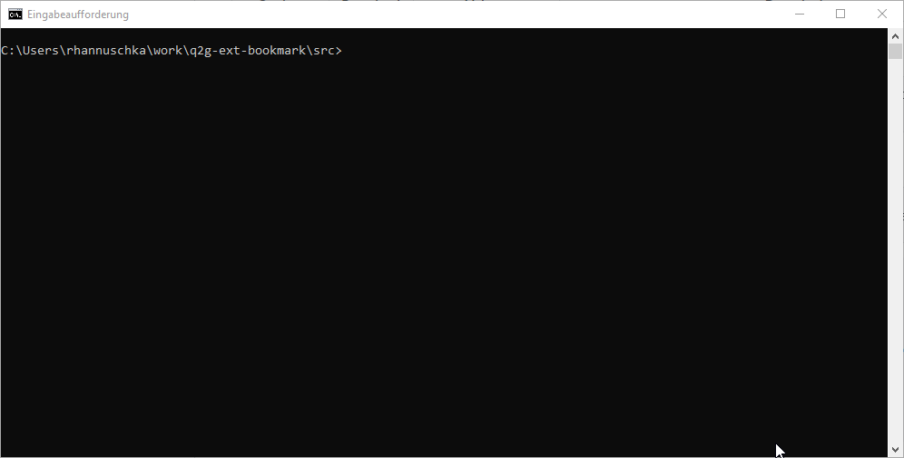

### Qlik2Go Build CLI

Simple CLI for Qlik2Go Build which helps to create all configuration Files which are needed for build process.

Go into source folder where package.json exists for the extension and run following command: 

q2gb --init <extension|webpack> to start helper to create extension or webpack build configuration/files.

